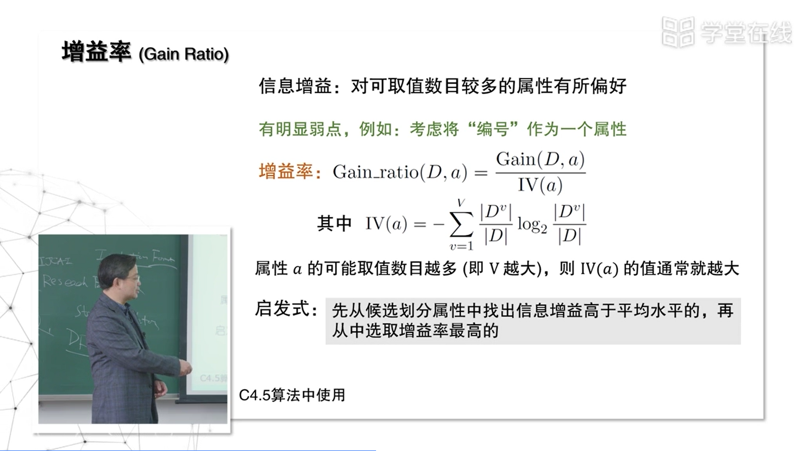

### 4.0 决策树

Date：2022/10/20

------

[TOC]

------

​		决策树是 ML 里最早变得非常重要的模型，可以说它是最开始导致 ML 成为独立学科的一个模型。由于决策树较简单，以此开头较合理。

### 4.1 决策树基本流程

* 对上述三种情况进行了说明；对于三种情况下，如何选择、如何确定输出正负进行了说明。
  * （1）叶子节点为同一类，直接输出；后验概率；
  * （2）属性不足以继续划分，停止——叶子节点中谁多，就用谁输出；后验概率；
  * （3）如果当前结点包含空样本（例如瓜色有三种，但拿到的数据集很不幸有一种颜色没有数据，那么也停止），这种情况下，回退到父节点，把父节点当作先验概率。

* 此类伪代码，需要掌握（论文、材料当作常用）
* 另外，虽然知道有三种分类，代码也是对三种情况进行的编码，但我也想知道如何获得这三种分类，是否科学家在实验当作总结的吗？或者经过观察，验证得到的吗？如果推广到各种问题，例如《计算之魂》里经常出现许多分类情况，是如何获得的？这里的思考是否具有一般性？或者分类是从树模型的抽象意义推导得到的？这时候体现了图论的意义，也要补充知识。
  * 阅读书籍（P73，下）讲到，每个测试的结果**或是导出最终结论**，**或是导出进一步的判定问题**，其**考虑的范围是上次决策结果的限定范围**内——这算得上是得出三种分类的依据之一了，同时也是自然的结果。
  * 这段话对我很有启发性，如果在一般性地思考不同问题的分类情况，也可以参考 **“状态的可能性”**，此处则是先认识到决策的过程是从根节点下行到叶子节点的，即**先认识到判定生成的顺序**，而**结果将位于叶子节点**，由此，**进一步需判定该叶子结果是否可用**——于是，可直接用的，自成一类；数值为空，自成一类；不可直接用的，先自成一类，再考虑进一步的判定方法——当然，最后一类或许涉及进一步的分类，但由于属性集不足以支持再次细分，所以只能从决策树的相关性上考虑，最自然的就是回到问题的边界——即该叶子节点的判断范围受其父节点的影响——由此作为一种先验概率是自然而合理的。

------

### 4.2 信息增益划分

* 决策树很大程度上受到了信息论的启发，所以很多东西是根据信息论里的准则作为判断。
* 信息论中非常重要的：熵

* [05:00] 有一段黑板解释，但未理解

* 【感悟】
  * 这一节似懂非懂，要补充信息论的知识，或许也该读读 Shannon 的文字。
  * 在这之前，懂得代入公式，计算结果即可。
  * 主要问题是，没搞清楚什么时候计算纯度，每生成一层节点之前算？谁算，交给算法自己算？公式为什么前面是负号？（P75）
    * 负号：由于 log 里面的是小于 1 的数，因此对数运算会拿出来一个负号——或许等式前面的负号，类似最小二乘法 $\frac{1}{2}$ 系数的作用，便于计算。

* 想当然了，没有再次确认，以为还是三位小数

------

### 4.3 其他属性划分准则

* 如何识别偏好？

* 视频断层，书中没找到对应的名词
* 信息增益（ID3的划分准则），如果只考虑信息获得，其实是一定程度上偏好了分支多的属性，因为取值越多、分支越多，分到的每个分支上的样本就会越少，自然地，相对于那些分支少的树就更干净了。

* 分母 $IV(a)$ 称为**规范化**，以后会在很多地方看到这个东西的变形。当我光考虑你的分数不太够了，我还要考虑你的成分的时候，我们把这个东西放到分母上，这起到了规范化的作用，**把原来不可比的东西变得可比**。
  * 规范化把数值变为 [0, 1] 范围，称为归一化。
  * ML 和数据分析里面的基本操作，例如量纲的不同，取值范围相差很大的情况
* 这种算法将 ID3 分支多的问题抵消掉了。

* 抓球、袋子例子。
* ==这里没太理解公式的解释==
  * 两个求和符号，又忘记了其中的意义了；
  * 为什么把求和与其中一个式子分开解释？

* 可以设计出非常多的划分准则，最关键的是如何衡量经过一个操作后，后面的东西变得比原来更纯净了。信息增益通过信息熵的计算来表达什么是更纯净了，而基尼是用一个概率，一次抓两个球，概率小了就更纯净了。可用类似的方法定义很多，就可得到不同的决策树算法。那么，自然地考虑到，这些东西的差别有多大呢？终于在决策树发展了很多年后，提出了很多变体之后，大家开始研究这件事——划分属性造成的影响有多大。

* 【感悟】
  * 一门课，一位好老师，对比只看课本，差别非常大。能学到很多 “联系” 知识——串讲。为后面自学提供了指引。
  * 双重求和符号

* 这里套公式也比较疑惑，答案很别扭
* 迷惑，虽然知道这次划分是一次错误的划分，相应的信息增益应当是 0，噢，可能正是因为信息增益为 0，0.998 + 0 = 0.998
* 但如何说明、如何计算信息增益为 0 呢？这里有许多概念要学习。

------

### 4.4 决策树的剪枝

* 由于决策树倾向于叶子节点尽量的纯净，可能会在叶子产生许多**不具有一般性的特征**，因此剪去这些叶子，尽管模型的准确率下降，但泛化能力反而上升了。
* 通常，**如果使用单一决策树，要剪枝**；而后面学习的集成学习则不需要剪枝。

------

### 4.5 缺失值的处理

* 这节非常重要，缺失值的处理是 C4.5 决策树算法的重要贡献，影响了近几十年对缺失值的处理思想。
* 以前是把缺失的扔掉，但实践发现不可行。如果数据缺失的是非常集中，那么丢掉影响不大；若面对维数变高，如几千维的数据，会发现有大量样本缺失，通常每一维都有数据是很难的，可能一个样本只有几维没有数据，如果扔掉，可能导致90%的数据都用不上

* **==非常关键的思想：样本赋权，权重划分==** 

（1）先算有值的信息熵

（2）这步关键。

* 缺失的值，按照已有数据的类别比例，当作缺失数据补充的先验概率。
* 把有值的样本进入各个属性的划分结果这个后验，当作了没有值的样本应该进入它的先验。
* 样本8、10缺失值，都要同时进入三个分支，按照已有样本的比例值分别设置权重——如何理解把一个样本拆分成权重不同的三部分？添加权重后，直接参与信息熵和信息增益的计算吗？

------

### 【04 EXAM】

* 这题是否关于增益率（P79，上）的内容？我考虑的时候跟权重方法对比了
  * 否，而是（P74，下）
  * 对应第 11 行。

* 错着错着，突然懂了这题问什么。对应第 5 行。
* ==**找到题目与书本的出处，非常重要**== 
* ==**更重要的是，知道为什么这样做**== 

* 为什么不可以？书本出处？跟采用编号进行划分的误区思想对应吗？

* （P78）注意是两个概念

* 我考虑的是（P80，下）的 $IV(·)$ 值，搞反了——理解大致是对的，因为增益率是信息增益与规范化分母的比值，计算可得
  * $\frac{Gain(D,色泽)}{IV(色泽)} = \frac{0.109}{1.580} \approx 0.069$ 
  * $\frac{Gain(D,触感)}{IV(触感)} = \frac{0.006}{0.874} \approx 0.0069$ 
  * 结果上整整查了一个数量级，因此色泽的增益率更大

* 尝试了计算，尽管错了；这里结合公式进一步理解。

* 【勘误】

* 经过老师的讲解，以及这两题的提醒，我理解了为什么不简直容易造成过拟合了。

* 第一反应是看了书本的图，思考训练集与剪枝前后有关系吗？虽然蒙对了，但结合解析稍有理解了。
  * 不一定要画出决策树。根据分支，一步一步、一层层判断即可。
  * 性别女都 “是”——所以后面不必判断是否喜欢ML作业，剪枝了。
  * 验证集精度的计算，用来衡量剪枝前后的泛化性能。

* 不剪枝，还是原来的决策树。
  * 我目前的理解是，对照了书本 P79-83，认为验证集的精度是对正例的占比计算的——算出来剪枝后是 75%，因为所有女生都算作正例，验证集 4 个当中共 3 个正例。
  * 那么剪枝前为什么是 50% ？
  * ==似乎要再次学习 “精度” 的概念。==
    * P29，精度：分类正确的样本数占样本总数的比例。可见我的理解是片面的。
    * 但如果按照书本 P79-83 的精度计算，我的理解是依据的，但这个矛盾认知出现在什么地方？
    * 应该围绕（P81）的分类正确、分类错误来衡量验证集。
* ==疑问==
  * 上述生成的决策树，是剪枝后还是剪枝前的？如果是剪枝前，那么为什么女生的叶子节点已经被替代了？

* 心急了。这里是理解的【开始做题前，停5秒】

2022/10/20 16:33:22 3h58min

------

