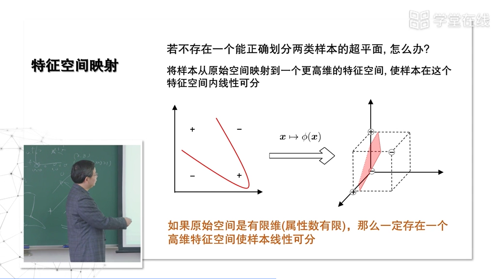

### 5.0 支持向量机

Date：2022/10/22

------

[TOC]

------

​		这部分学过 “推化” 的话，很简单

### 5.1 支持向量机基本型

* 这里出现了一些新概念，部分涉及优化领域的术语
  * 支持向量（图中确定这个超平面的几个点，同方向上确定的两个平行向量）
    * 做了测验题，这里理解错了：距离最近的、平行的有几个点，就有几个支持向量
  * 超平面
  * 为什么间隔最小为1？
  * 凸二次规划
  * 拉格朗日乘子
* 【视频断层】见黑板

* 这类是知识性错误

------

### 5.2 对偶问题与解的特性

* ==补充知识【读西瓜书后面的数学内容】==
  * 拉格朗日乘子
  * 凸优化
  * 稀疏性
    * 周老师解释，有点理解——满足条件的解仅集中在这个支持向量机上，因此称为稀疏

 

* 下界的判断？大概懂定义，但没应用过

------

### 5.3 求解方法

* 支持向量机的基本型
  * 对于线性可分的问题，可找到正中间的那个划分；
  * 在划分过程中，要找到一个简单的优化技术，用拉格朗日乘子化简后，最后变成一个闭式解的问题，就更高效了；
  * 得到闭式解后，用 SMO 再得到一个迭代的解法，对计算就更友好了。
* 现实问题经常不是线性可分的，因此需要在基本型的基础上，加一些变化

* 如何理解 “违背程度” ？前提要理解 KKT 条件的意义

------

### 5.4 特征空间映射

* 例如对两个点
  * （x，y）
  * （x，y，x+y > 1）
  * 用一个更高维的特征空间，使得样本在该空间内线性可分，这个空间可以是无限维的——非常巧妙的方法

* 无限维向量的内积很难算，而且计算开销非常大；
  * 观察发现，两个无限维向量始终是以内积的形式出现的；
  * 因此，可以尝试找另一个东西代替。

* 对照了书本的公式。为什么这个公式长这样？需要什么知识来理解？
  * 应该是线代知识，其中的线性空间

------

### 5.5 核函数

* 这里黑板讲得很精彩！
  * 技术黑话
  * 函数是一种变换规则
  * 甚高维

* 支持向量机最好的就是把它不清楚的东西已经清楚地告诉了你，那些它不清楚的地方就是你要去试的

------

### 5.6 如何使用SVM？

* ==这个学习方法很关键==

* 【视频断层】
  * 没有讲软间隔，但本视频中引用了被剪辑的内容

* P133，但不懂区别

* 当然，是蒙对的

------

### 【05 EXAM】

* 错了反而有点理解了，但对于 C ，设想过——以为不行，其实已经变为三维空间了，所以还是有升维的

* 看了解答，确实是理解了。就是把原来二维的点，用一个条件放在指示函数里，根据指示函数的结果，提升为三维的点。而第三维的点具体取值是 0 或 1。
* 课堂上老师讲的把一个角拉高，就很形象了。

* 这题很关键，错了
* 问的是支持向量——最靠近的只有四个，因此答案为 4，说明我前面理解的错了，一个点表示一个向量，而不是点的组合。

* 这题不理解知识，是直接求的欧氏距离，且书本暂未找到对应内容
* 答案是 $dist(x_1,x_2)=\|\phi(x_1)-\phi(x_2)\|_{\mathcal{H}_k}^2=\sqrt{k(x_1,x_1)-2k(x_1,x_2)+k(x_2,x_2)}$

* 这里不知道怎么算，选择否，依据是 “+1”，设想正对角线不会等于 0，但错了

* 这里依据是，类比函数的平移。但错了。

2022/10/22 15:59:25 1h43min

------

