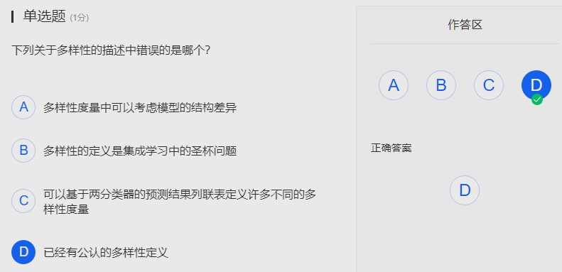
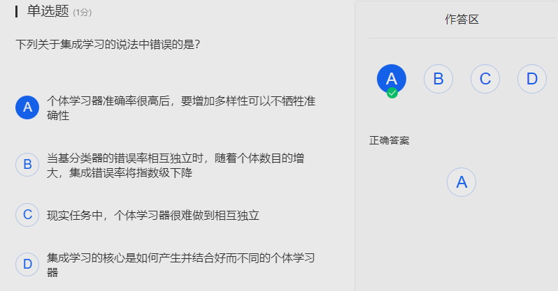

### 8.0 集成学习和聚类

Date：2022/10/24

------

[TOC]

------

### 8.1 集成学习

* 成分/个体，弱学习器，通常称为个体
* KDDCup 是数据挖掘最大的比赛

------

### 8.2 好而不同

* 使用的条件很强，只是从理论上给到的一个支撑，但并不是一个可直接操作的东西
* 如果每个模型都是99%，通常是高度相似的——如果融合，意味着要牺牲部分性能（牺牲个体性能，换取整体性能），这是很难操作的

------

### 8.3 两类常用集成学习方法

* 生成后面的，依赖前面的；可理解为串行
* 一个算法好不好，除了理论支撑，还要考虑工程好不好用
  * XGBoost，陈天奇；

------

### 8.4 Boosting

* 支持向量机阅读材料，讲到配准（Alignment）
* 一般使用同质的模型，因为更好用
  * base 基（P171）
  * baseline？不同
* residue minimization
  * 残差

* D 一开始，纠结于C D，而我发现，自己对于 D “似乎”缺少了一些判断能力，直到我想起C4.5 缺失值的处理机制，才联系起来 D 是正确的。
* C Boosting 算法理论保证的因素很多，权重可以影响收敛的方向，但这个条件不够强？或许还有更好的解释。
  * 什么是获得理论保证？达到理论的效果？
  * 同时，权重调整作用的对象是什么？个体学习器？错误样本？

------

### 8.5 Bagging

* Bootstrap 真强大的思想
* RF，Random Forest

* B 是明显错误的
* C 虽然采样得到的是不同的 set，但这些 set 都是为其后的若干个 base learners 服务
* D 从相同分布采用得到，是对的——一开始以为说的是每个 set 的分布相同，其实看错了，也是心急。

------

### 8.6 多样性度量

* 通常离不开这些想法，但是否就够用呢？
* diversity

* 76种，但并没有真正解决问题

* 告诉我们，从领域直觉上，个体差不多，diversity更大些，模型应该可以做得更好，但是我们是否能把这个 diversity 刻画出来，从数学上。但目前，所有的方法都没有一个一致的认可。
  * 以前都是从性能，可能还要从结构，做预测的结构差异（周志华组）
  * ==圣杯问题 Holy grail== ——多样性的定义
    * 想起《失控》
* ==这些东西，就是书上不会讲的，却又起到醍醐灌顶作用的== 

------

### 8.7 聚类

* 内容较多，但要点不多。
* 有监督
  * 分类、回归
* 无监督
  * 聚类/集簇（对应分类）、密度估计（对应回归）

------

### 8.8 聚类方法概述

* 聚类的好坏，取决于用户，但用户可能的希望是无穷尽的；所以总能找到一个标准，说以前的不好。

* 文献最多的领域，没有客观标准；
  * 让我想起《人工智能导论》当中提到的经典概念，根据维特根斯坦《哲学研究》的观点，并非一切都可以用经典概念来表示。例如人、美、猫、狗，严格上都无法用经典概念表示。【这里需进一步思考】
* 但要问：
  * 你给出的这个标准，在现实中到底重不重要？
  * 或者你给的标准完全是虚构的，就不重要了。

* 你每想要一种聚类结果，都可能有以前的算法不适合它
  * 工作中，如果做聚类，试了很多以前的方法都不 work，很正常；
  * 因此，做聚类首先要确定你的标准；一定要基于你的标准，找到类似的改

* ==聚类要学好，就不能说学到了多少种聚类的方法，而是要知道大概做聚类，会有哪几种典型的思路，这些思路以后可能会用上，再根据你的标准，对思路结合，可能就得到针对性的算法。==【其实也是明确学习的边界，哪些方向是不对的，哪些是对的】

* 原型聚类
  * 研究得最多，背后有非常好的概率意义上的解释
  * k均值聚类等，都可看作高斯混合聚类的特例；高斯混合聚类，既可以从统计学习的角度诠释，也可以从贝叶斯学习的角度诠释
  * 通常只能找出椭球结构，不适合处理香肠结构
* 密度聚类
  * 适合做香肠结构
* 层次聚类
  * 粒度

* 【感悟】
  * 可参考聚类方法的归纳分类：名称、假设、过程、代表

* 【视频断层】
  * 废非质量距离
  * 标红中重点讲的，都剪辑掉了

* 这里是蒙的

------

### 【08 EXAM】【计算题】

* 几个选项，B 是错误的，只适用于回归，不适用与分类；
* A 的疑问是，不仅多样性，还有性能，但显然这题没考虑性能，也当作正确；
* C 是多样性度量的内容，但这里解释我认为还不够
* D 不确定这里，训练误差是对已有样本而言，是否在讨论泛化误差，即未知样本的问题？

* 这里用了排除法
* D 为什么错误？是否因为个体性能在融合过程中，作出了平衡，因此应该说获得性能更好的整体，而非个体，并且个体甚至有可能性能下降。

* 主要是分母太别扭，而且对比其他度量，用的结果较少，直觉上这个度量是片面的

* 纠结于 B C
  * B 是因为大量随机样本会改变原数据集的分布，是否会带来一种破坏性？并且如果不会，其实只是相当于增大了基础的样本量，对于多样性的没有直接贡献。
  * C 我理解是，不同的属性输入，是否意味着不同学习器对于整个数据集处理的视角不同？这样的结果能结合在一起吗？或者正如上一题说的，要尽量做到个体学习器的相互独立，所以反而是一种好方法？

* ==以下题目需认真回答==，这类题目有非常重要的反馈意义

* 不知道从何开始理解，是直接看6公式？是先要求偏导？
* 还是要先梳理清楚步骤有什么、每步做了什么、为什么做？

* 错了。并没有先看随机森林算法，而是想当然
* 随机森林的步骤更多，个体学习器的性能往往有所降低

* 依据是多样性不仅来自样本扰动，还来自属性扰动

* 因为抛开多边形，只看样本分布，有香肠结构，不适合用原型聚类

2022/10/24 16:01:42 1h23min+18min

------

