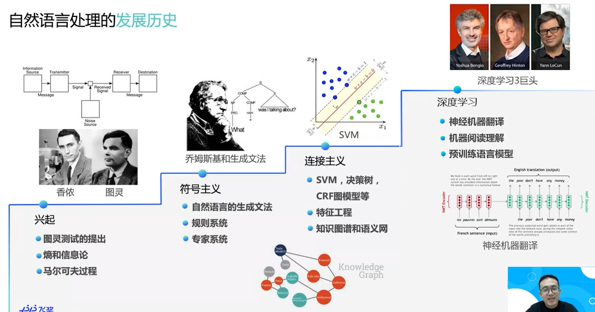
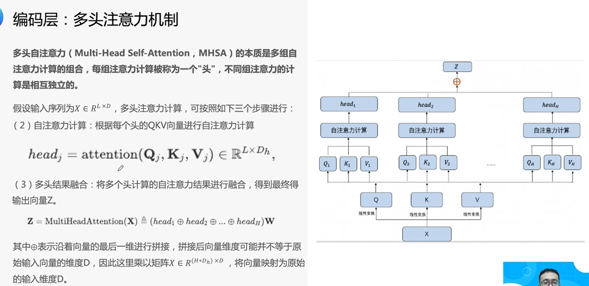
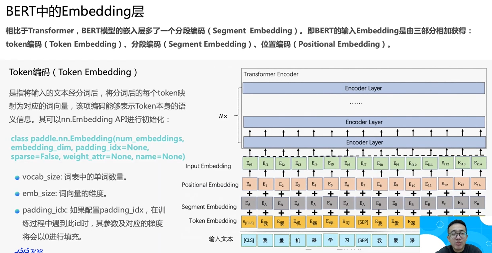

### Task00 Paddle 深度学习总结

Date：2023/03/15 17:13:08

------

[TOC]

------

### 00 意义

​		总结的意义在于，每当习得一系列的新知识，可以从一个符合自己认知习惯和规律的层面进行加工，从而帮助大脑形成合适的认知抽象视角，即可以帮助自己找准理解新知识的角度。我更愿意把这个目标称为 “获取合适的抽象视角” 。

* 这样做的好处可以归纳为：
  * 调动学习的**主动性、参与感**，对信息进行更深的**加工**，便于认知生理结构的形成；
  * 提高**信息提取**的可能性；
  * 形成**信息快照**，提高间隔性**复盘效率**；
  * 帮助获取合适的抽象视角，便于找到对待新知的**合适认知模式**。

------

### 01 深度学习简介

* 课程：[零基础实践深度学习（第 2 版）](https://aistudio.baidu.com/aistudio/education/group/info/25302)
* 部署：[Windows 下 conda 部署 Paddle](https://www.paddlepaddle.org.cn/documentation/docs/zh/install/conda/windows-conda.html#anchor-0)
* 延伸：[进阶参考](https://www.paddlepaddle.org.cn/tutorials/projectdetail/5603475)

------

### 02 一个案例吃透深度学习

​		本章以 “手写数字识别” 为例, 从横纵结合的视角分别展开讲述了深度学习任务流程的普遍共性，包括**五个基本步骤**：数据处理、模型设计、训练配置、训练过程、保存模型。

​		横纵讲述的方式，就像带着地图去学习，更有方向感，也能大致知道当前步骤存在的意义。不过，学了一遍之后，可能由于学得比较仓促，而且每个小节的项目文档还没有精读，导致第二天进行回顾的时候，并**没有留下太深刻的整体印象，因此也难以掌握细枝末节**，这个过程好比刷墙，目前只是简略地从上往下跳着涂了一遍，墙上还有许多留白的洞需要补上。因此，现针对昨日笔记，进行一次复盘小结。主要内容有：

#### 01 背景知识

* 手写数字识别案例的意义
* 房价模型直接迁移带来的问题
* 横纵讲述的优点
* baseline 的意义
  * 关键：完整性

#### 02 思路分析

* 数据处理的依赖包、基本思路
* Paddle 的 API 文档
  * 关键：理清输入、输出的数据类型
  * [Paddle API 文档入口](https://www.paddlepaddle.org.cn/documentation/docs/zh/api/index_cn.html)
* 如何对房价模型进行调整，以适配手写识别任务
  * 环节：模型设计、训练、测试
  * 关键：判断原有的做法是否有效

#### 03 数据处理

* 如何分析数据格式的显式特征
* 数据处理的五大操作（完整流程）
  * 读入数据、拆分样本集合
  * 训练样本集乱序、生成批次数据、校验数据有效性
* 超参数与技巧较多，例如
  * 学习用数据集（较理想） VS 开发用数据集（乱脏缺、需校验）
  * 如何选择神经网络的层数、训练过程用什么方法
  * 参数复杂度、训练步长、batch 凑齐……
  * 关键之一：未污染的测试训练集
* 模型性能的经验比较
  * 从成果的角度：不明显的提升，通常意义不大
  * 从技巧的角度：越精妙，往往越难迁移；越朴素，往往更具有通用意义
* 异步读取数据（常用）
  * 让两个环节脱钩, 并行来做, 整体会非常高效
* 数据增广
  * 局限性：任何数学技巧, 都不能弥补信息的缺失——Cornelius Lanczos
  * 关键：合理伪造

#### 04 网络结构

* 采用的神经网络不同，网络结构的将有所差异，所能解决的问题也会发生改变，这也是神经网络种类繁多的原因之一
* 类比视觉相关神经用来做听觉感知任务，效果是不如直接使用听觉相关神经来得好的，更何况输入的信号类型不一致，这也加大了迁移与学习的成本
* 关键：模型要有针对性, 匹配的才是好的

#### 05 损失函数

* 分类任务
  * 输出标签，由背后的概率分布支撑
  * 损失函数：均方误差 VS 交叉熵
    * 通常：$交叉熵 \sim \frac{1}{\text{准确率}}$ 
  * 激活函数：Softmax 函数（非线性变换）
    * Softmax 把模型的实际输出值变成概率分布值
  * 关键：最大似然思想（最小化交叉熵）

#### 06 优化算法

* 学习率
* 四种主流优化算法：
  * SGD（随机）
  * Momentum（仿 “惯性”，减震）
  * AdaGrad（动态调整，渐降）
  * Adam（思路正交，二三结合，应用广泛）
* 模型参数初始化
  * 初始值：利用预训练模型的参数（可加速网络训练、得到较高精度）

#### 07 资源配置

* 实际开发，往往需考虑 CPU、GPU 分布式训练（多卡）等资源调配问题
* 分布式训练（多卡）
  * 模型并行：一个网络模型拆分多份，分到多个设备上（GPU）训练
    * 张量并行、流水线并行
    * 数据相同，节省内存，但应用受限
  * 数据并行：一次读取多份数据，给到多个设备（GPU）上的模型
    * CPU-PRC 稀疏参数、GPU-NCCL2 稠密参数
    * 模型相同，主流用法，各设备梯度不同，需梯度同步机制
      * PRC 通信方式（Parameter server，Trainer）
      * NCCL2 通信方式（Collective）

#### 08 训练调试与优化

* 优化思路的五个关键环节
  * （1）计算分类准确率，观测模型训练效果（交叉熵 VS 准确率）
  * （2）检查模型训练过程，识别潜在问题（打印、定位）
  * （3）加入校验或测试，更好评价模型效果（三集合，欠拟合、过拟合）
  * （4）加入正则化项，避免模型过拟合（整体/局部参数 + 正则化项）
    * 防过拟合
      * 加入正则化项：增加了模型在训练集上的损失
      * 暂退法 Dropout：每次迭代，随机丢掉（屏蔽）每层若干神经元，用余下神经元继续训练
  * （5）可视化分析（打印 Loss VS matplotlib、VisualDL）

#### 09 恢复训练

* 需求：训练过程主动或被动的中断
* 保存和加载模型
  * 预测场景：只保存模型参数
  * 恢复训练场景：保存模型参数、优化器参数
* 效果：恢复训练与未中断训练的效果完全一致

#### 10 动转静部署

* 保存和加载模型之后，需对接部署工具，涉及动静态图概念
  * 声明式编程（静态图）：先编译后执行（全局）
  * 命令式编程（动态图）：解析式地执行（交互）

------

* 2023/03/15 19:12:25 2h36min 2.1-2.5
* 2023/03/15 23:44:54 3h30min 2.6-2.9
* 2023/03/16 17:27:56 2.10

------

### 03 计算机视觉基础

​		本章简要介绍了计算机视觉的内容、应用及主要挑战，结合若干子任务，分别从任务目标、模型框架、基本原理、代码实践等方面展开了分析。

​		正如人的大部分信息通过视觉获取，我们也希望让机器学会如何去 “看”。

* 因此，可以定义如下六种 “看” 的行为：
  * 图像分类（分类；CNN、Transformer）
  * 目标检测（标注位置；Anchor based、Anchor free、Transformer）
  * 图像语义识别（分割、tag；细粒度）
  * 实例分析 OCR（文字识别；两阶段、端到端算法、图网络）
  * 视频分析（分类、分割、时空、时序；帧联系）
  * 图像生成（GAN；修复、迁移、生成）
* 概念补充
  * 全连接/多层感知机
  * 卷积（互相关运算）
  * 池化（输出综合置换）
  * dropout（随机删除部分神经元）

------

### 04 计算机视觉基础案例实践

------

### 05 更复杂的计算机视觉任务：目标检测

#### 01 目标检测基本概念和 YOLOv3 设计思想

* 图像分类处理基本流程（如上图）：
  * 输入 $\longrightarrow$ 图像特征提取（卷积网络） $\longrightarrow$ 特征表示 $\longrightarrow$ 分类器 $\longrightarrow$ 预测 $\longrightarrow$ 选出概率最大类别
* 背景：**目标检测无法按照此流程进行（流程无法体现不同目标的区别）** 
* 思路：
  * 假设存在某种方式，使得在输入图片的基础上，生成一系列可能包含物体的区域，称为**候选区域**（Region Propposal, RP）。在一张图上，可以生成若干个 $RP$。对每一个 $RP$，可以把它当作**单独**一幅图像，并使用图像**分类**模型进行处理，看它属于哪个类别或场景
  * 关键：**穷举解构图像，单独分类识别**
  * 如何产生候选区域？
    * 两点 $A$ 和 $B$ 确定一个矩形框 $AB$ 
    * 问题：穷举计算量，生成 $RP$ 数目约为 $\frac{W^2 H^2}{4}$ ？
* **工具：目标检测算法**
  * 需求 => 目标：产生候选区域的方法，提升候选区域分类效率
  * **Anchor-Based**（Anchor 提取候选目标框，在特征图上的每一个点，对 Anchor 进行分类和回归）
    * 两阶段检测算法（分段）
      * R-CNN 系列（**Fast R-CNN**、Faster R-CNN 等）
      * 优劣：具有较优的精度，但是预测速度较慢
    * 单阶段检测算法（同时）
      * YOLO 系列（YOLOV2、YOLOv3、YOLOv4、PP-YOLO、PP-YOLOV2 等）
      * 优劣：网络结构更加简单，检测速度快
    * 优劣：
      * 手工设计 Anchor 需要考虑 Anchor 的数量、尺寸(长宽比)；
      * 在特征图上像素点密集滑动会生成的检测框会存在大量负样本区域，就需要考虑正负样本不均衡的问题；
      * Anchor 的设计导致网络超参数变多，模型学习比较困难；
      * 更换不同的数据集需要重新调整 Anchor。
  * **Anchor-Free**（不再使用预先设定Anchor，通常通过预测目标的中心或角点，对目标进行检测）
    * 基于中心区域预测的方法（FCOS、CenterNet等）
    * 基于多关键点联合表达的方法（CorNert、RepPoints 等）
    * 优劣：
      * 不需设计 Anchor，模型更简单，耗时更少，但精度比 Anchor-Based 低

* 概念

  * **边界框（Bounding Box，BBox）**

    * 真实框（ground truth box）
    * 预测框（prediction box）
    * **注意区分两种格式**
      * $xyxy$ （ $x_1 y_1$ 左上角， $x_2 y_2$ 右下角）
      * $xywh$ （ $x y$ 中心，$wh$ 宽高）
    * 输出：$[L, P, x_1, y_1, x_2, y_2]$，其中 $L$ 是类别标签，$P$ 是物体属于该类别的概率

  * **锚框（Anchor box）**

    * 定义：指人为预先设定好比例的一组候选框集合（也可自动生成）
    * 那么，如何对初始锚框进行合理的调整呢？
      * 固定的，需微调，模型可训练习得微调方法

  * **交并比（Intersection of Union，IoU）**

    * 用途：衡量锚框与真实框之间的关系
    * $IoU = \frac{A \cap B}{A \cup B}$ ，即相交量比并集总量

    

    * 思考：根据坐标表示的交并比计算公式是否可完全覆盖？

  

  * **非极大值抑制（Non-maximum suppression，NMS）**
    * 用途：消除重叠较大的冗余预测框
    * 原理：只选出得分最高的那个预测框，其余丢弃
    * 如何判断两个预测框对应的是同一个物体呢，标准该怎么设置？
      * 如果两个预测框的类别一样，而且他们的位置重合度比较大，则可以认为他们是在预测同一个目标，继而与设定的超参阈值进行比较，大于阈值则舍弃（YOLOv3 默认 0.5）

* 2023/03/27 4:29:51

------

#### 02 单阶段目标检测模型 YOLOv3

------

#### 03 目标检测 YOLOv3 实战：叶病虫害检测

* 问题汇总
  * 作业中的 Anchor 是手动定义的，如何通过算法习得？

------

### 06 自然语言处理基础

​		第一节介绍了自然语言处理（Natural Language Processing，NLP）在人机通信当中的意义，并且介绍了 NLP 的应用场景，如翻译机、语音助手、搜索、推荐等。同时，还介绍了 NLP 中的深度学习技术的发展历程与发展方向，强调以 BERT 为分水岭的预训练模型技术在 NLP 的核心地位，而当下大模型的应用场景也愈加广泛。最后，介绍了 NLP 发展的主要挑战及应对方法。

​		NLP 从 1950 年前后兴起，到 1966 年符号主义的奠定而进一步发展，随之 1980 年连接主义的兴起而引入了新的活力，继 2006 年深度学习的成果而焕发了新一轮春天。而 2022年 NLP 领域的 ChatGPT 浪潮又引起了大众空前的持续、广泛的思考。

​		NLP 的发展历程，围绕着**两大挑战**展开，一是**语言学挑战**，例如同义词的判断、语言歧义、不同语言的分词方法、多轮对话中的指代和省略等等；二是**计算挑战**，例如自然语言本身的编码形式与计算机的二进制语言、自然语言编码本身并非数字，无法直接计算。

​		在解决这些挑战的过程中， NLP 形成了**两大技术划分**，一是**理解**，另一是**生成**。“理解” 将给定文本分析、计算，产生计算机可以理解和处理的统一形式，主要解决 “词法、句法、语义、回指” 这四种歧义性；“生成” 将计算机产生的语义表达结果转化为人类可以读懂的自然语言过程，大致可以分为三个阶段 “文本规划、语句规划、实现”。换句话说，“理解” 是让计算机去理解人类语言，“生成” 是让计算机去表达人类语言。

​		第二节介绍了语言模型及其局限性，提出了目前使用更为广泛的神经网络语言模型，讲述了词向量、词方法实现语言模型的基本思路，同时讲解了经典的词向量算法 CBOW 和 Skip-gram 的原理、结构、实现、问题与改进，最后提及了预训练模型对于 NLP 的可操性。

​		语言模型（N-gram）的含义，通常是指：**语句语序出现可能性最大的概率模型**。由于语言模型存在局限：无法建模更远的关系、词相关性不足、泛化能力不高，继而又出现了神经网络语言模型（NNLM）。

​		前面提到 NLP 的计算编码挑战，为了规范化自然语言，便有了 “词向量（Word Embedding）” 这一抽象结构，词向量是一种表示自然语言单词的方法，把每一个词都表示为一个 n 维空间内的点，即一个高维空间内的向量，从而将自然语言计算问题转化为向量计算问题（相当于高维空间里的降维操作，未理解降维关系）。

​		为了实现词向量，需要思考两个问题：如何把词转换为向量？如何让向量具有语义信息？神经网络计算需要大量算力，通常借助 GPU 等硬件的算力，一般以张量（Tensor）为单位展开，因此实际我们需要把 Embedding lookup 过程转换为张量计算。而利用单词的上下文信息，可以帮助消除单词的歧义，即可以赋予向量语义信息（但这里涉及一个启动标签的问题？其实不然）。

------

### 07 自然语言处理模型的网络结构

#### 01 NLP 经典神经网络

​		算法上，本节介绍了 NLP 经典的神经网络，如循环（递归）神经网络 RNN、长短时记忆网络 LSTM，以及基于混淆矩阵的网络评估方法。应用上，介绍了情感分析在电商评价与电影评论当中的角色定位。技术上，介绍了情感分析的两种建模方式，分别为加和平均法、序列建模法，同时介绍了采用多个 LSTM 单元接一个全连接层，结果由 Softmax 处理实现输出的模型架构。

​		最后，介绍了使用 Paddle 基于 NLP 经典入门数据集 IMDB 进行情感分析的完整实例，其中 seq2vec 实现了降维操作。

------

#### 02 Transformer网络结构

​		本节介绍了具有里程碑意义的新模型 Transformer，这是一种自注意力模型，解决了 RNN 长距离依赖、不能进行并行计算的问题。

​		因为自注意力模型得到的结果值通常比较大，需要归一化处理，而结果又涉及概率，除以 $\sqrt{D_k}$ 可以使得数据变集中；另外，考虑到除法运算之后得到的是数值，因此为了提取系数，用 Softmax 处理。

​		除了自注意力模型之外，还有 Seq2Seq 模型，指的是从序列到序列的模型，常用在语音和语言任务。Seq2Seq 模型往往采用编码器-解码器（Encoder-Decoder）的结构设计，主要用于异步的序列到序列的深度学习任务，这是一种相当重要的结构，应用十分广泛。其中包含了自控制结构，编码器用于处理输入，将向量传给解码器，解码器则逐字逐句生成输出，并且解码器内部可层层衔接，进一步处理解码器之间的输出，形成具有深度的网络结构。

------

​		接着，介绍了 Transformer 的网络结构（如下图所示）。其中，第八章讲述的 BERT 模型，满足左侧的结构，而像 GPT 模型，则需要加上右侧的结构。

​		假设 Transformer Encoder 和 Decoder 部分均为六层网络结构，则具体结构如下图。

​		可以看到， Transformer Encoder 结构有一层嵌入层、若干层编码层。嵌入层生成特征表示，编码层生成当前的特征编码向量，编码层采用多头注意力机制实现，利用正余弦函数的周期性变化，对每个 token （序列单词）进行位置信息表征。

​		多头注意力机制，本质是多组相互独立的自注意力计算（即多组 “头”）的组合，每组根据输入向量序列 $X$，获得相应的 $Q、K、V$ 向量，最后计算均值，获得一组用于多头计算的向量，即将各头的结果融合，得到最终输出向量 $Z$。

​		多头注意力计算之后，结果由 Layer Normalization 进行归一化处理，LN 方法很适合 NLP 模型。接着，自下而上观察目前的结构或处理机制，都是线性的，这会导致结果对于可能的非线性情况泛化能力减弱，于是引入 Feed Forward 进行非线性处理，模型性能的提升可参考相关论文。

​		最后，数据经由加与规范层（Add & Norm）处理，引入残差连接和层规范组件，残差块通过跨层短接的方式，使得信息向前传播更快，梯度向后传播更快，从而降低了随着网络加深带来的模型过拟合风险。相关的内容，可以通过研究模型设计的思路，逐步拆解组件而加深理解。

------

### 08 自然语言处理任务的新范式：预训练语言模型

#### 01 预训练语言模型 BERT

​		本节讲述了预训练模型（pre-training language model）对于自然语言处理的范式革命，引出了**预训练（pre-training）+微调（fine-tuning）**的 NLP 新范式。而具有里程碑意义的是 2018 年提出的预训练 BERT，BERT 名字来源于美国的一档儿童教育节目《芝麻街》，就像 Transformer 来源于《变形金刚》一样，AI 算法的命名似乎走上了戏剧化的道路。

​		这种新范式，允许我们采用首先在（超）大规模语料库上进行训练的开源模型，而后基于该预训练模型进行微调，并且在下游任务当中获得更好的表现。换句话说，开源预训练模型提供了**通用的无监督数据**，提高了**特定任务下的有监督数据**开发调优的可能性。目前，BERT 是主流的预训练模型。

​		BERT 利用**两个预训练任务 MLM 和 NSP** 任务学习语言相关的知识。掩码语言模型（Masked Language Model，MLM），掩码策略以 “80% 替换 Mask token、10% 随机替换为其他词、10% 保持不变” 的比例进行分配；下一个句子预测（Next Sentence Prediction，NSP），部分无关句子拼接生成句子对，部分按照原文语序，通过判断两句话在原文中是否前后相邻，实现语序识别与训练。总言之，MLM 基于**单词替换策略**形成语料库，NSP 基于**句子乱序策略**形成语料库。

​		最后，比较重要的是**预训练模型的范式表**。

* 这里需再次复盘

------

#### 02 NLP 主流任务和快速实践

​		本节介绍了 NLP 领域基于 BERT 的四种经典任务，分别是：分类式任务、问答式任务、序列标注式任务、生成式任务。最后讲解了基于 BERT 实现文本匹配的完整实例。

​		具体任务机制如下：

* 分类式任务（文本分类）
  * 句对分类任务（两段话）、单句分类任务（一段话）

* 问答式任务（阅读理解）
  * 问题与文档拼接，从输出的序列向量定位答案起始位置
  * （如果本身没有答案，这种方法是否仍有效？）

* 序列标注式任务（命名实体识别）
  * 基于文本分析，打标签

* 2023/03/28 23:30:07

------

