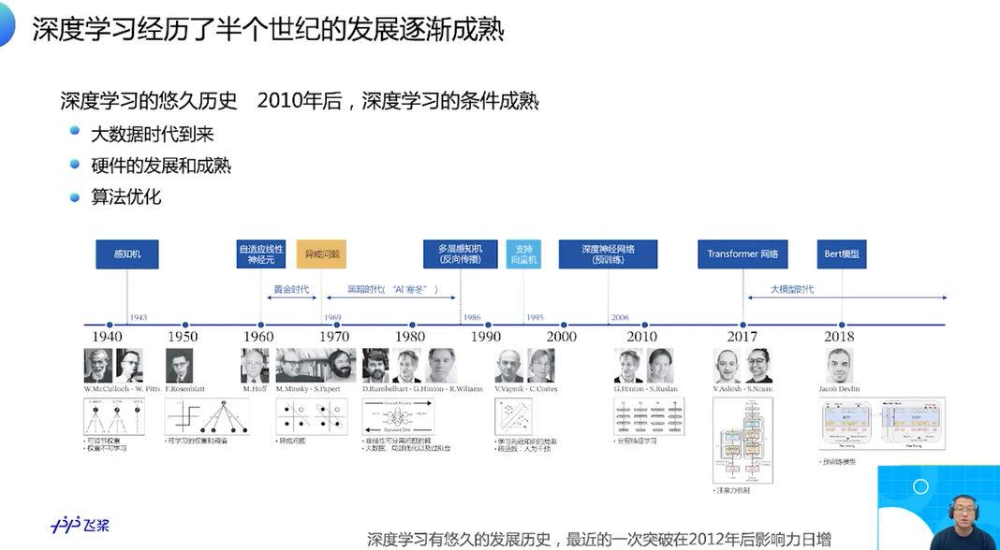

### Task01 零基础入门深度学习

Date: 2023/03/10

------

[TOC]

------

#### 1.1 前言

### 1.2 机器学习和深度学习综述
#### 1.2.1三个概念的定义和关系

* 区分
  * 用 Python 写的: ML
    * 真正产生产业实践意义的重要领域
  * 用 PPT 写的: AI

* 从人类学习方式, 思考机器的学习方式(设计)

* Layer
  * 机器实现学习的执行框架, 体现了学习的本质是"参数估计"
  * 机器学习就是拟合一个"大公式"
  * 使用数据去计算假设g去逼近目标f

* Layer
  * 与机器学习相比, 深度学习模型的复杂度难以想象
  * 期望: 高级语义输出(多层感知机, 模拟人脑神经元)

#### 1.2.2深度学习的历史和今天

* 最小的基本单位
* 让参数从随机到符合目标需要

* 1940 年代, 模拟结构; 但最大的问题是参数不是学习的
* 1950 年代, (最大的改进)参数是可学习的
* 1960 年代, 神经网络(当时不叫机器学习), 都是单层的, 连简单的异或问题也无法解决
* 1980 年代, 发现多层组织的神经元(组成网络)的时候, 作用大大提升(能够表达的知识概念, 本质规律的复杂度急剧上升, 复杂的函数关系也可以), 但当时比较流行的逻辑斯蒂回归,  SVM, 随机森林, 多层感知机的效果会好一些, 但训练起来麻烦很多, 而前者已经能够满足当时许多的现实问题的需求了
* 期间不温不火地发展
* 2010 年前后, 深度学习带来了语音, CV, NLP 等领域的数量级效果提升
* 2018 年, 大模型时代
* **(学习这种整体性分析历史阶段的表达)**

* 第一个显著变化
  * 当时, 模型效果, 更看重对业务的理解; (例如找到某个特征, 使得模型非常好使)
  * 如今, 谁能获得更大量的数据, 同时用深度学习框架进行了高效训练, 应得到比较好的模型
* 第二个显著变化
  * 设计的范式比较固定(底层的通用架构), 可以应当种类非常多的深度学习模型(另一方面, 可见这套范式满足了这个时代的需求, 而像冯·诺依曼, 则提出了具有超越时代需求的通用框架; 如果走在前沿, 可以考虑紧扣需求和暴露的问题, 再思考范式迭代的必要性)
  * 框架化, 带来工业化的变革

* 世界经济低迷的这个阶段, 如果年增长率能够达到 20% 的行业, 已经非常朝阳了
* AI 逐渐从互联网向其他行业渗透(国家指示: 数字化, 智能化)

* **这一段观点非常高, 具有一种理性严谨的客观性, 值得反复学习**
  * 2020 年开始, 互联网的增长和业务模式基本不会有太大的变化了(Why? 什么因素决定的? 是体现价值的内容, 基本上都充分挖掘和利用了吗? 哪些内容是互联网体现价值的? 以此展开了解互联网行业, 互联网红利的来源)
  * 互联网从一个非常高科技的行业, 迅速变成一个传统行业;
  * 而 AI 产业, 每年增长 20%, 实际上要技术真正落地, 这里面的技术增长可以维持 20 年, 30 年, 甚至更长的时间(距离产业细节真正落地, 还需要消化很久), 说明 AI 对人才的需求周期是更长的
  * 供给视角:
    * 说明 AI 符合一个好职业的特点(技能演进速度)
    * 具有职业成长深度
    * 能力要求是复合的(因此供给缓慢)(同理, 学习的养成也是急不来的, 但可以避免低效和陷阱, 少走弯路)

* 2023/03/10 15:03:22

------

### 1.3 使用Python和Numpy构建神经网络
#### 1.3.1波士顿房价预测问题

* 一个有种族倾向的数据集

* DL 的套路很强

* 分饭的设计(一口一口)

#### 1.3.2建模的第一步 处理数据（上）

* 观察数据(二维的表)
* numpy 读取数据, 而读入内存的是一个大 array, 因此需要再次处理

* 1-D 转换为 2-D

* 数据拆分
* **题目的意义不是为了背下来, 而是通过题目, 把背后的一套规律和知识学会**, 就像平时的习题, 考试的题目, 它们背后的规律和知识是一样的, 知识外在的形式不同(死记硬背的方法就无效了)
* 这如同训练集和测试集的意义

* 归一化是经常要做的

* 2023/03/10 15:31:55

#### 1.3.2建模的第二步 设计模型（下）

* 多层叠加之后,  y 变成一个多项式线性加权和的关系
* 很多的问题, 都可以用这样多项式表达, 于是, 讨论的问题切换到深度学习模型

* 分析一元一层的情况(点乘)
* b 随机赋值
* **只需要最基础的线性代数知识, 因为深度学习中的运算流程, 实际上是一系列的基于向量的各种数值化操作**

* forward 即前向计算的最核心逻辑
* 用类表达

#### 1.3.3模型的损失与优化

* 有了损失函数, 下一步就是根据损失函数, 找到一组参数, 使得 lost 最小

* (真实情况)解析解通常是算不出来的, 计算过程太复杂, 维度庞大
* 单向函数
* 盲人下坡法(探不到谷底, 但可以探四周)

* 对比了均方误差和绝对值误差的区别, 从而说明选择的原因
  * 均方误差更合适
    * 绝对值误差可能存在不可导的点
    * 均值误差更能感受到坡度的变化, 曲线接近底部变缓, 利于进行优化手段

* 关键点: 如何决定下一个点? (梯度的反方向)

* 2023/03/10 16:55:59

#### 1.3.4梯度下降的代码实现（上）(需复盘)

* 对一个样本进行

#### 1.3.5梯度下降的代码实现（中）(需复盘)

* 对多个样本进行

* 广播机制的批量意义

* 梯度更新的方向, 所有样本的 "意见"

#### 1.3.6梯度下降的代码实现（下）

* **全流程串连** 
* step 1

* step 2

* 进一步说明归一化的意义, 可使得统一的步长更合适 (eta 控制) (妙啊)

* step 3-1

* step 3-2

#### 1.3.7.1随机梯度下降原理与实现方法

* 杀鸡用牛刀(资源浪费 + 无用功多) -> 产生了随机梯度下降法
* 这里应该可以更好地理解 batch 的意思了

* 步骤

* 通常, 最后喂入的样本会对模型有较大的影响, 就像平时吊儿郎当, 但期末变乖乖学生, 老师的印象就会变得好一些 (这个类比太妙了)
* 因此, 避免这个现象带来的问题, 需要随机打乱样本(只要求打乱样本顺序, 不要求打乱特征的顺序) (如何区分两者? 看表对应哪些部分可以吗?)

#### 1.3.7.2随机梯度下降实现模型训练

* 全流程
* step 1

* step 2 (**深度学习的一招鲜**)

* 改造完成

* 毛刺产生的原因
  * 每次更新所用的样本是比较少的, 所以会振荡
  * 但只有整个流程的大趋势一致, 我们的目的就达到了

* 提示: 考虑极端情况
* 提示: 结合四步走

* 这两题有助于理解前向计算
* 这个例子讲得很透彻, 围绕链式法则的公式展开
* **疑问**
  * 如何理解此时偏导的含义?
  * 如何理解每一层的含义? 是否能赋予实际意义? (例如解释为折扣, 如何理解这个折扣, 数量?)
  * 为什么这个案例可以用来说明两个方向的梯度计算?

* 代码实现

* 2023/03/10 17:42:45 4h

------

### 1.4 飞桨产业级深度学习开源开放平台介绍
#### 1.4.1为什么要有深度学习框架

* 没有必要把那些理论都写一遍, 可使用框架

* 故事: 广告作弊检测(C++ 写组网等, 3个月限制)
* 如今: 3-5天

#### 1.4.2使用飞桨实践深度学习的优势

* 部署到线上才能真正发挥作用

* 更常见的产业开发模式: 模型调优

* 软件

* 硬件

#### 1.4.3基于飞桨的广泛应用及飞桨安装

* 应用

* 制造业: 仅仅有 AI 模型不够, 通常需要对于整个制造流程的改造才能配合
* AI 的迫切程度: 非常实际, 计算成本效益; 例如电池生产线, 原本一道工序需要 3 个工人, 如果换成 AI + 1个工人可以解决, 那将节省 2/3 的用人成本

* 目前中国 AI 应用最大的场景: 城市摄像头; 巨大的流量, 如何用好会产生巨大的价值
* **具体如何参与智慧城市的 AI 开发?** 

* 无人机航母检测 (大数据分析, 诊断)

* **不知道一些点会产生多大的价值** 
  * (讲了保险公司一个简单的场景, 竟然可以大大提高效率, 节省人力) 
  * (这么看来, 真的是了解不够, 而且应该善于发现类似的场景, 就像以前反反复复改一份 CAD, 时间折腾在软件的加载/保存/操作上, 那种时间也是浪费的)
  * (做标书的业务部分, 也是这样), 仔细想想, 有太多场景值得被 AI 取代了

* 办公楼自动化养猪
* 专业物品鉴别(购物, 代购的信息减负, 比价)
* **深植行业才能想到的** (讲得非常实际, 全面)

* 2023/03/10 18:34:59 50min

------

### 1.5 使用飞桨重写波士顿房价预测任务
#### 1.5训练过程和校验效果

* 飞桨: 动静统一

* 2023/03/10 19:26:55

------

### 1.6 深度学习能力的全面认知和快速实践

* Layer
  * PaddleHub
  * Fine-tune API
  * 大模型实践
    * 主题文本生成
    * 生成未来的自己
    * 宫崎骏动漫风格
    * 证件照生成
    * 行人检测
    * 中文情感倾向分析
    * 快递单识别
    * 视频打标签
    * 语音转文字

------

### 1.7 附录：NumPy介绍
#### 1.7.1NumPy介绍（1）

* 核心数据结构

* reshape 可以把一维的变成其他

* 数组的效率

* 建议查阅 numpy 手册

#### 1.7.2NumPy介绍（2）

* 激活函数可以让深度学习模型具有非线性拟合能力
* 浅层的 DL, 可以用 Sigmoid 函数, 要求更高的 DL 模型, 通常用 ReLU 为激活函数

* 以标量的方式操作

* 代码可视化

#### 1.7.3NumPy介绍（3）

* 飞桨库

* 对比 numpy 的 array, 多了一些 DL 任务的参数和方法(这也是自定义 DS 的意义所在)

* 讲解了两种数据结构的使用场景 (考虑了性能损失的情况)

* 复习

------

### 开营讲座

* 阅

* 2023/03/12 21:11:53

### 作业

* 这里被绕进去了

* 什么是开发套件?

* 2023/03/12 21:28:09

* 作业截图

