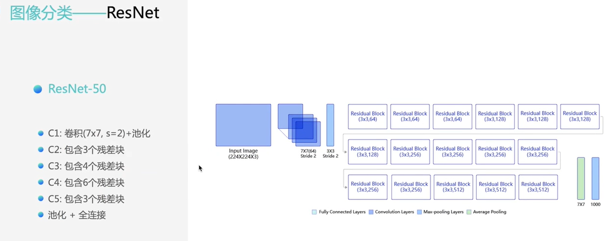

### Task04 计算机视觉基础案例实践

Date：2023/03/22 15:34:45

------

[TOC]

------

### 4.1 常用的基础组网模块

#### 4.1卷积神经网络基础

* 卷积可解决上面两个问题

------

#### 4.1.1卷积

* 可理解为核大小
  * 从低层到高层，如同从局部到全局的过程，这保证了后面任务是基于全局判断的
* 既然有了卷积核大小的概念，为什么还要有感受野的概念？
  * 懂了，两个是不同的概念，卷积核大小是工具本身的性质
  * 感受野大小是经过卷积核处理（可以有多个），输出得到的特征图对比输入的特征图能够表示的程度，例如原本的图 28 * 28，输出 变成 14 * 14，则感受野为 2 * 2（这里计算有点问题）；应该用信息量的大小来表示，输出后的图尺寸小了，但单位像素所代表的信息量大了

------

#### 4.1.2卷积应用举例

------

#### 4.1.3池化

* 池化：进行信息聚合化

------

#### 4.1.4激活函数

------

#### 4.1.5批归一化

* 最常用的，有效的

------

#### 4.1.6丢弃法

* 作业

* 2023/03/22 20:41:37

------

### 4.2 图像分类基本概念和ResNet设计思想
#### 4.2.1图像分类基本概念

* 关键一步：特征提取

------

#### 4.2.2ResNet

* 提到残差网络的提出，解决了上面的部分问题
* 模型 A 可看作模型 B 的特例

* 维度要对得上
* 短路连接功能

* 分布情况

* 2023/03/22 21:52:44

------

### 4.3图像分类ResNet实战：眼疾识别

------

### 4.3图像分类ResNet实战：眼疾识别
#### 4.3.1眼疾识别数据集

------

#### 4.3.2模型构建

------

#### 4.3.3损失函数

------

#### 4.3.4模型训练

------

#### 4.3.5模型评估

------

#### 4.3.6模型预测

* 总结

* 作业

* 2023/03/22 22:04:24

