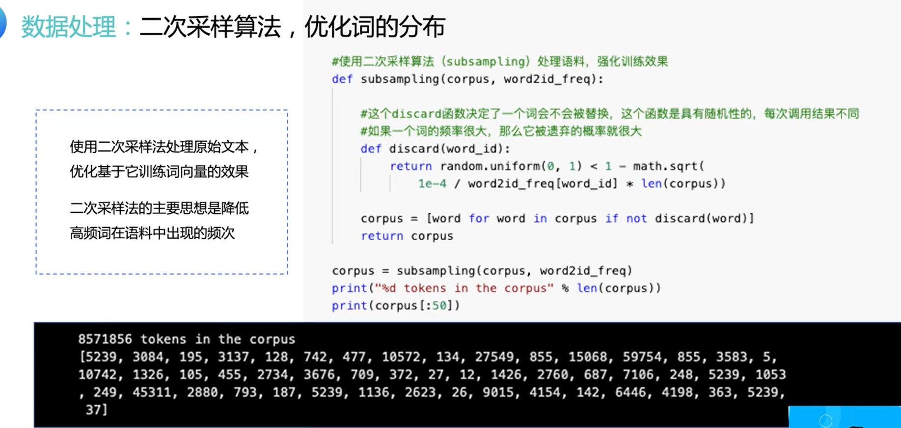

### Task06 自然语言处理基础

Date：2023/03/27 15:58:19

------

[TOC]

------

### 6.1 自然语言处理综述

------

#### 6.1.1自然语言处理概述

* 指数增长（ 找找这种图的来源）

* 预训练模型：NLP 核心方向（BERT 为分割点，重中之重）
  * 逐渐往大模型的方向发展

------

#### 6.1.2自然语言处理发展史

* 1950前后兴起、1956符号主义、1980连接主义、2006深度学习

* 特征工程的内容很多，而且换模型后基本不适用

------

#### 6.1.3自然语言处理技术全景

* 这位老师讲得非常好，学习他的讲述方式、链接词、例子、切入点
* 另外，课件的形式也值得学习

------

### 6.2 词向量：迈向 NLP 领域的第 1 步台阶

#### 6.2.1 语言模型

* 语言模型对应理解后面的词向量和词方法很重要
* 组成语句语序出现可能性的最大概率

* 语言模型的问题：无法建模更远的关系、词相关性不足、泛化能力不高
* 矩阵 $ C $ 的渊源
* 这里提到的信息量蛮大的，而且 PPT 外的讲解较多

------

#### 6.2.2 词向量基础概念

* 词向量：高维空间里面的降维操作

* 排序

* 多义词，语料关系很多，通常是用不同的语料库进行训练，以提高模型在相应上下文环境的泛化能力

------

#### 6.2.3 词向量算法

* 最经典的算法，这篇文献要读读

* CBOW 模型结构如图

* 提到交叉熵

* softmax 计算每一位都有算，所以累加的计算量很大

------

#### 6.2.4 用飞桨实现 Skip-gram

* 建立带 id 的词典

* 根据 id 序列表征句子

* 有些词对训练效果的影响不好（例如 “的、地、呢”）

------

#### 6.2.5 用 PaddleNLP 加载词向量

* 2023/03/27 18:02:01

------

