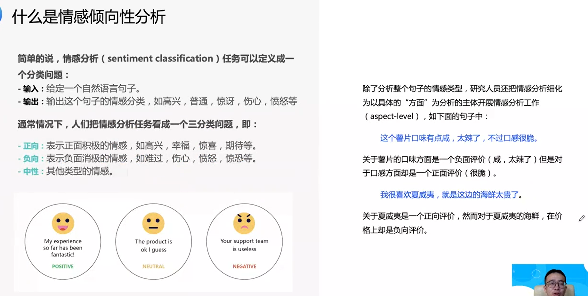
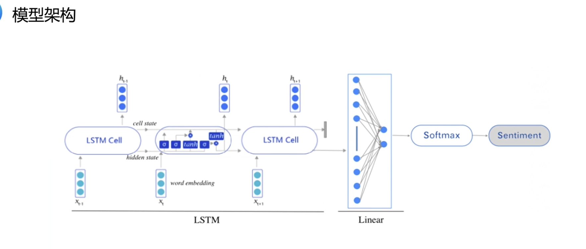

### Task07 自然语言处理模型的网络结构

Date：

------

[TOC]

------

### 7.1 NLP经典神经网络

#### 7.1.1RNN、LSTM、评估指标

* 或者 “递归神经网络”

* 面对长序列，性能不佳，因此改进，有了 LSTM

* 门结构

------

#### 7.1.2 情感分析、建模方式、模型架构

* 情感分析（Hello World）

* 2023/03/27 20:32:41

------

#### 7.1.3 用飞桨实现情感分析

* 经典入门 NLP 数据集

* 关键是做成迭代器

* 模型搭建：

* 分析网络如何搭建：

------

### 7.2 Transformer网络结构

#### 7.2.1自注意力模型

* 为了解决 RNN 长距离依赖、不能进行并行计算的缺点

* $\alpha$ 即注意力系数

* 因为结果值比较大，需要归一化处理，而结果又涉及概率，除以 $\sqrt{D_k}$ 可以使得数据变集中；而除法之后得到的是数值，因此为了得到系数，用 Softmax 处理

* 模型单元：

* 2023/03/27 21:44:57 

------

#### 7.2.2 Seq2Seq模型

* 这种结构很重要，泛用性很广

* 自控制结构的实现

------

#### 7.2.3 Transformer模型 *

* 本内容后面学习，只会用到左边的结构，而像 GPT 模型，则需要加上右边的结构

* 六层

* 利用周期性变化，表征位置信息

* Layer Normalization 归一化处理，很适合 NLP 模型
* 观察其余结构，都是线性的，而 Feed Forward 可处理非线性内容，加入后能够提升模型性能（论文）

* 思考模型设计的意义

------

#### 7.2.4 新闻分类任务实现

* 先搭建一层 `encoder_layer`，再用 `TransformerEncoder` 搭六层结构（层层叠加）

* 权重衰减 line 27
* 模型很多操作都是为了减少过拟合（层多了就容易过拟合，就像人一样，学得多了，如果不丢弃一些，或者做一些规范整理，思绪就会更具有倾向性而妨碍了进步）

* 当完成所有模型训练，认为模型收敛之后，就可以做模型测试

* 作业

* 总结

* 2023/03/28 16:48:15

------

### 第三周 直播课 LLM 模型

* 2023/03/27 20:30

* 零样本预测能力
* 思维链涌现 OCT

* 插件补短板

* 数据飞轮的形成
* 达芬奇 002

* 必然逃不过理论基础，Transformer 的 decode 结构
* 自编码模型，自回归模型

* 沿用了预训练 + 微调的结构（YOLO 作业也是这么做了）

* 发现：零样本的多任务能力（涌现）

* GPT-3 2020 年，60 页报告（讲训练过程、实现思路）
* 两种问题
  * 胡说八道
  * 安全风险

* API、玩等方式，形成了数据飞轮的闭环

* 后续课程讲解

* 第八节很关键
* GPT 开源中间件
* GPT-3 预训练模型不建议继续微调，因为成本太高（几千的集群）
  * 官方更希望基于 prompt 挖掘
  * 应该储备的知识：如何写 prompt、如何对接数据库，等到 API
* 文心千帆（2023/03/27 下午发布）
* 跟上，多学，挖掘工具能力
* ChatGPT + Plugins 新生态
* toB 商业化变现

