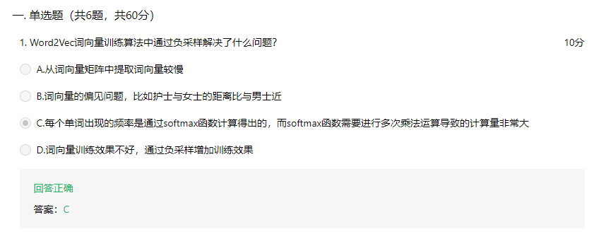
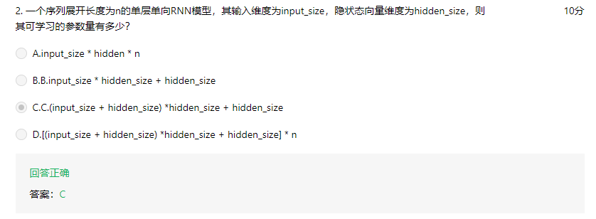
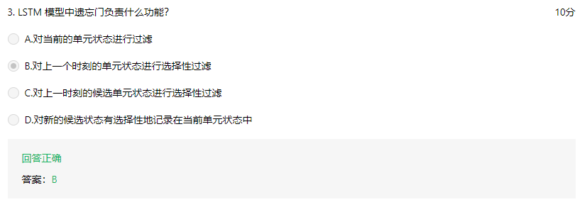
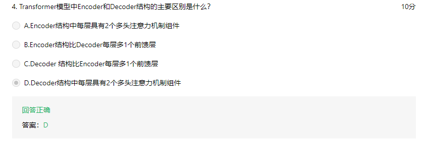
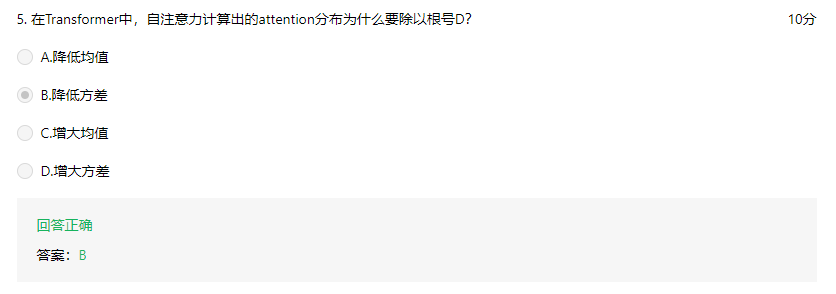
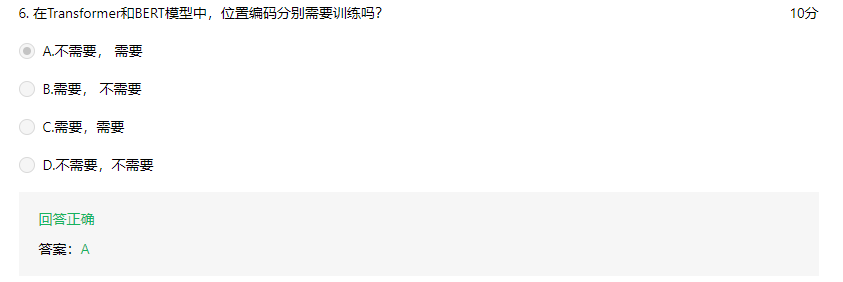
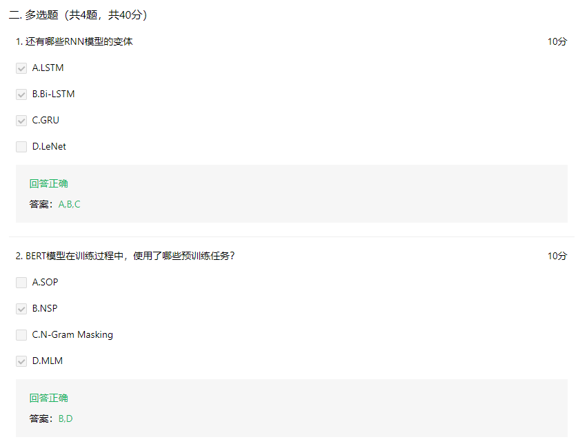
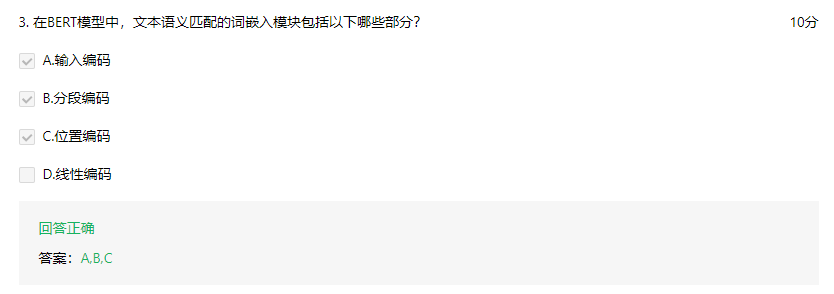
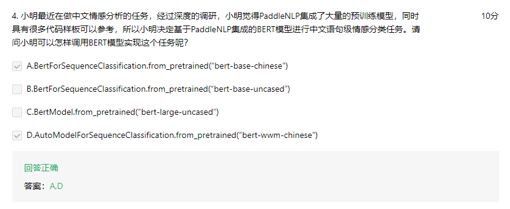

### Task08 自然语言处理任务的新范式：预训练语言模型*

Date：2023/03/28 16:52:29

------

[TOC]

------

### 8.1 预训练语言模型 BERT

#### 8.1.1 BERT 网络结构

* 通用无监督数据（超大规模预料，对比之前 YOLO 项目，模型复杂程度也高很多）

* Positional Embedding

* 2023/03/28 17:09:14

------

#### 8.1.2 BERT 模型的预训练任务

* MLM 和 NSP
* `[mask]` 80%、10%、10%

* 编出句子对

------

#### 8.1.3 预训练模型拓展

------

#### 8.1.4 PaddleNLP 中预训练模型

* **一定要牢记：预训练模型的范式表** 

------

### 8.2 NLP 主流任务和快速实践

#### 8.2.1 基于BERT实现 NLP 主流任务

* BERT 微调形式：

------

#### 8.2.2 基于BERT实现文本匹配*

* warm up 策略，常用

* 总结

* 2023/03/28 19:48:14

------

* 学完要总结不同老师的讲述方式、知识编排顺序、提出的问题，并思考或完成练习题

### 作业

* 机制背景题
  * 负采样通过从负样本中随机采样，然后用较小的数据集代替 Softmax 函数的计算，从而提高计算效率

* 计算题
  * 需要搞清楚 RNN 模型结构

* 机制题

* 机制题
  * Encoder 由 Encoder Layer 堆叠而成，其中**每层**组成为：
    * Multi-Head Attention
    * Feed Forward
  * Decoder 由 Decoder Layer 堆叠而成，其中**每层**组成为：
    * Masked Multi-Head Attention（多出的多头组件，用来注意 Encoder 输出）
    * Multi-Head Attention
    * Feed Forward

* 原理题
  * 视频讲过，除以根号 D 可以使得数据更集中，因此方差会降低，D 是向量的维度，这样的处理方式让我想起微积分中的绝对误差和相对误差

* 机制题
  * 两者实现方式不同，Transformer 的位置编码是通过公式直接计算的，是固定向量，因此不需要训练，而 BERT 的位置编码是通过额外添加一个可学习嵌入向量实现的，因此需要进行训练

* 通识题、机制题
  * LeNet 是典型的卷积神经网络，并非 RNN，RNN 在后面才提出
  * SOP 和 N-Gram Masking （传统语言模型）呢？

* 机制题
  * 输入编码即 token 编码
  * 为什么要有这三部分？

* 通识+技术题

------

* 2023/03/29 1:01:50