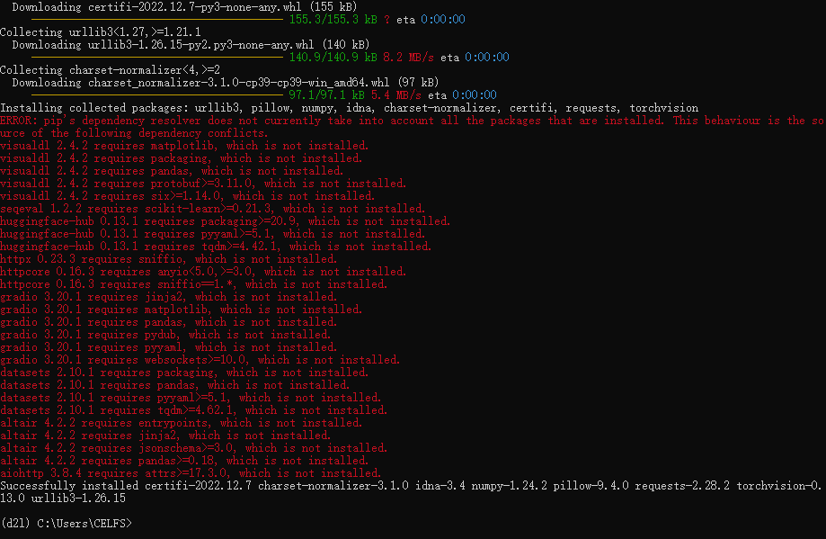

### Task01 初识深度学习

Date：2023/03/18 16:50:43

------


[TOC]


------


### 00 深度学习简介


* 应用场景
  * 图片分类、物体检测和分割
  * 样式迁移、人脸合成
  * 文字生成图片、文字生成
  * 无人驾驶……
* 案例研究——广告点击
  * 步骤：触发 ==> 点击率预估 ==> 排序（点击率 × 竞价）
  * 预测：数据 ==> 特征提取 ==> 模型 ==> 点击率预测
  * 训练：训练数据（过去广告展现和用户点击） ==> 特征和用户点击 ==> 模型

* 完整的故事
  * 领域专家（更关注产品）
  * 数据科学家（数据到模型的实现）
  * AI 专家（进一步提升模型）

* QA 话题参考
  * 可解释性、三类人定义、paper 、误判率与风险


------


### 01 环境部署

```bash
# 创建环境
conda create --name d2l python=3.9 -y

# 激活环境
conda activate d2l

# 查阅已安装包列表
conda list
pip list
```


------


### 02 安装框架及软件包

```bash
# 安装 PyTorch 的 CPU 或 GPU 版本
pip install torch==1.12.0
pip install torchvision==0.13.0
```

* 同时尝试了给出的两种 `PyTorch` 版本，其中在安装完成第一指令后，执行第二条指令报错：依赖包不全

```
ERROR: pip's dependency resolver does not currently take into account all the packages that are installed. This behaviour is the source of the following dependency conflicts.
```



* 下面先继续安装 d2l 包

```bash
# 安装 d2l 包
pip install d2l==0.17.6
```

* 执行发现，依然存在部分依赖包不全的问题


* 暂时忽略问题，先进入 `Python` 解析器，验证安装情况

```python
import torch

torch.cuda.is_available()

>>> False
```

* 说明上述安装并未正确读到本机全局的 `cuda 10.2` （可能是版本原因），结合讨论区给出的方案，在 `conda` 环境中安装 `cuda 11.1`：

```bash
conda install pytorch torchvision torchaudio cudatoolkit=11.1
```

* 执行发现，该命令默认的源并未发现所需的安装包，因此，需补充源链接


* 我们可以查看已配置的 `conda` 源
* `conda` 常用指令 https://blog.csdn.net/qq_42395917/article/details/126237388

```bash
conda config --show-sources
```


* 在指令末端补充源链接后，依然提示找不到包。虽然可以继续尝试更换推荐的源，但这没什么关系，我们可以再找找其他形式的安装指令

```bash
conda install pytorch torchvision torchaudio cudatoolkit=11.1 https://mirrors.tuna.tsinghua.edu.cn/anaconda/pkgs/main/
```

* 结合讨论区的方案，再次尝试，成功识别 `cuda` 

```bash
pip install torch==1.8.0+cu101 torchvision==0.9.0+cu101 -f https://download.pytorch.org/whl/torch_stable.html
```

```python
import torch
torch.cuda.is_available()
>>> True
```

* 至此，耗时约 1 小时。我们可以查看 `cuda` 版本，以进一步确定调用情况

```python
# 方法一
import torch
from torch.utils import cpp_extension

torch.utils.cpp_extension.CUDA_HOME
>>> 'D:\\CUDA 10.2\\CUDA Development 10.2'

# 方法二
torch,version.cuda
>>> '10.1'
```

* `cuda` 版本调用情况 https://blog.csdn.net/AI_BING_/article/details/129316768
  * 提到：第二种查看结果，并不一定是 `Pytorch` 在实际系统上运行时使用的 `cuda` 版本，我对这个结果并不太理解，有待后续检验
* 总言之，真正有效的只有几行代码，一种方式不行，就换另一种尝试，跟着报错信息以及充分利用论坛资源，对于 debug 方向的确定是有直接帮助的。而部署过程中，报错往往是各种版本不匹配，因此在考究组件版本信息的时候，就要打起十二分精神了。


------


### 03 验证安装（跑模型）

* 报错：提示显卡满荷载
  * 显卡 NVIDIA GeForce MX250，显存 2.00 GiB
  * 提示已用 1.09 GiB，而模型训练需要 1.10 GiB
* 但实际监控数据发现，GPU 使用率不到 10 %（这可能只是因为训练过程没有持续，过早抛出异常），于是进一步排查
  * 参考 https://blog.csdn.net/weixin_41401924/article/details/120851573
  * 发现显存的增量是由于单次批处理量过大而引起的
    * 减少调整单次批量 `batch_size` ，并同时调整学习率 `lr` 

```python
RuntimeError: CUDA out of memory. Tried to allocate 18.00 MiB (GPU 0; 2.00 GiB total capacity; 1.09 GiB already allocated; 12.88 MiB free; 1.10 GiB reserved in total by PyTorch)
```


* 调整后，模型可正常进行训练，接下来，期待结果能正常输出
  * 训练过程
    * CPU 11%~16% 
    * GPU 92%~100%
    * VRAM 68%
    * RAM 54%
    * 耗时 2281.21 秒，38分钟


* 完成训练


* 2023/03/18 19:07:45 2h21min

------


### 04 问题汇总（待检验）

* 如果用 CPU 训练，耗时会多少？
* 本机 CPU i7-10710U，而 GPU MX250 的性能并不算高，尝试验证 CPU 效果
* `cuda` 版本的真实调用情况？如何比较上述的 “10.2” 与 “10.1” ？


